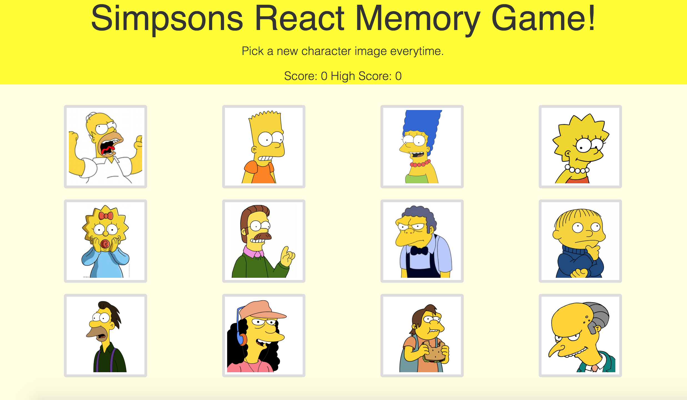

# Simpsons Card Memory Game

## About
This is a memory game built with React.js. The user tries to pick as many different simpsons cards as they can without chosing the same character twice. <a href="https://pure-harbor-13590.herokuapp.com/">You can play the game here.</a>
## Technologies Used
<ul>
  <li>React.js</li>
  <li>Bootstrap</li>
  <li>Heroku</li>
</ul>

## Future Improvements
The most signifigant improvement I want to make is replacing the alerts with modals. Besides this, I would like to use media quaries to make the thumbnails smaller on a phone. I also think the styling in the header could be improved. 

